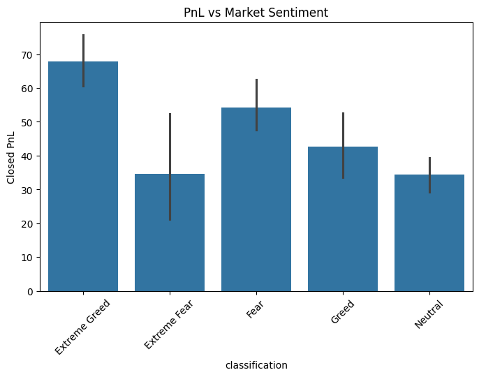
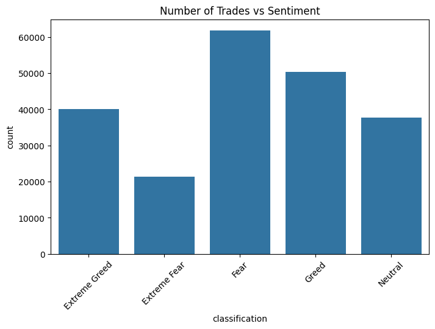
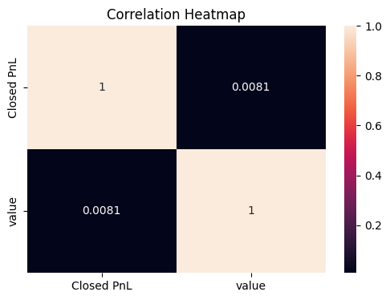

# trader-behavior-insights

# Trader Behavior vs Market Sentiment Analysis
## Project Overview
Analysis of trader performance based on Fear &amp; Greed market sentiment using Python. 
This project analyzes the relationship between **Bitcoin market sentiment (Fear & Greed Index)** and **trader performance** using historical trading data from Hyperliquid.
The goal is to uncover patterns that can help improve trading strategies based on market psychology.

##  Datasets Used

### 1. Market Sentiment Data

* Source: Fear & Greed Index
* Features:

  * Date
  * Sentiment Classification (Fear, Greed, Extreme Fear, etc.)
  * Sentiment Value

### 2. Trader Data (Hyperliquid)

* Features:

  * Account
  * Execution Price
  * Trade Size (USD & Tokens)
  * Side (Buy/Sell)
  * Timestamp
  * Closed PnL
  * Leverage (if available)

---

## Data Processing

* Converted timestamps into datetime format
* Extracted date for merging datasets
* Merged sentiment and trade data on date
* Cleaned and transformed numerical fields

---

## Key Analysis Performed

* Average **PnL by market sentiment**
* Number of trades across sentiment categories
* Buy vs Sell behavior under different sentiments
* Average trade size comparison
* Correlation between sentiment index and PnL

---

## Visual Insights

###  PnL vs Market Sentiment

---
###  Number of Trades vs Sentiment

---

###  Correlation Heatmap

---

## Key Findings

*  **Highest average PnL observed during Extreme Greed**
*  Lower profitability during Fear & Extreme Fear phases
*  Trading activity is highest during Fear and Greed
*  Buy/Sell distribution remains relatively balanced
*  Correlation between sentiment index and PnL is very weak (~0.008)

---

## Conclusion

* Market sentiment alone is **not a strong predictor of profitability**
* Traders likely rely on additional strategies beyond sentiment
* However, sentiment still influences trading activity and behavior

---

## Tech Stack

* Python
* Pandas
* NumPy
* Matplotlib
* Seaborn

---

## How to Run

1. Open `Trader.ipynb` in Google Colab
2. Upload both datasets
3. Run all cells
4. View analysis and visualizations

---

## Future Improvements

* Include leverage-based analysis
* Time-series modeling of sentiment vs PnL
* Strategy simulation based on sentiment signals
* Machine learning models for prediction

---

## Author
Anjali Kumari Yadav

---
